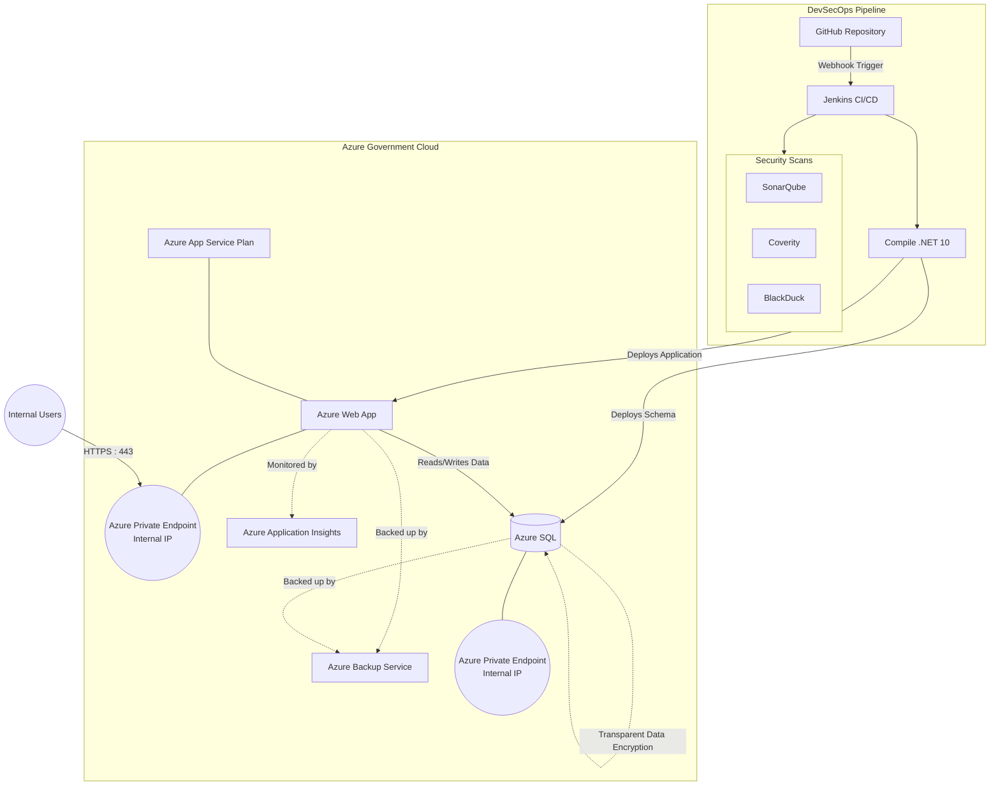

# Deployment Requirements

## 1. DevSecOps Pipeline

The DevSecOps pipeline performs the following steps:
- **Source Code Checkout**: Jenkins checks out the source code from GitHub via a webhook.
- **Security Scans**: Jenkins runs code security scans using:
  - SonarQube
  - Coverity
  - BlackDuck
- **Build**: Compiles the code using .NET 10.

## 2. Azure Government Deployment

Jenkins deploys the application to Azure Government with the following configuration:
- **Hosting**: An Azure App Service Plan hosts an Azure Web App, which is accessible via an Azure Private Endpoint.
- **Database**: Schemas and data are deployed to Azure SQL, which is also on an Azure Private Endpoint.
- **Encryption**:
  - All data in Azure SQL is encrypted using SQL Server Transparent Data Encryption (TDE).
  - All connections to the web app are over HTTPS on port 443.
- **Network Security**: The deployed application is only available internally over its private IP addresses on the Azure Private Endpoints.
- **Disaster Recovery**: The Azure Web App and Azure SQL are backed up using the Azure Backup service.
- **Monitoring**: Azure Application Insights monitors the application.

## Deployment Architecture Diagram

