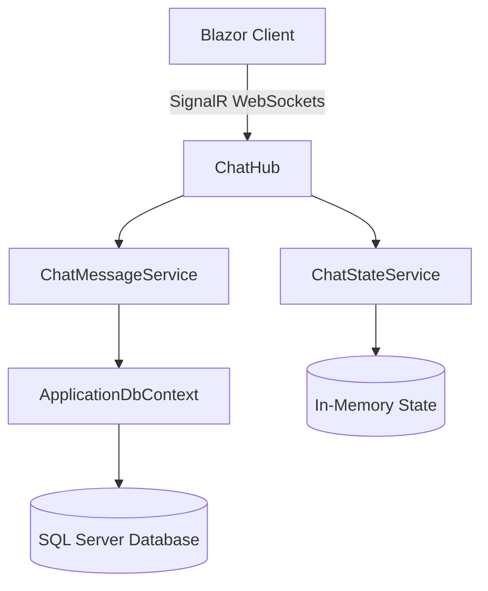

# ChatApp Requirements Document

This document outlines the features and requirements of the ChatApp application based on its current implementation using ASP.NET Core SignalR and Entity Framework Core.

## 1. Functional Requirements

### 1.1 Real-Time Communication 
*   **Persistent Connections**: The system must support real-time, bi-directional communication between the server and connected clients via SignalR (WebSocket).
*   **Online Presence**: The system must track users connecting and disconnecting, broadcasting their "Online" or "Offline" status to all other users immediately.

### 1.2 Messaging
*   **Private Messages (Direct and Group)**: Messages can specify a list of recipient IDs to restrict delivery to selected users. Global chat (no recipients) is systematically disabled.
*   **Message Properties**: Messages must contain the sender's ID, sender's name, text content, timestamp, and optional file attachment URL.
*   **Message Editing**: Users can edit the text content of messages they have previously sent. Edited messages notify all clients automatically.
*   **Message Deletion**: Users can delete messages they have previously sent. Deletions notify all clients automatically.
*   **Message Attachments**: Users can attach file URLs to messages.

### 1.3 Message Reactions
*   **Emoji Reactions**: Users can add specific emoji reactions to any chat message.
*   **Reaction Toggling**: Users can add a reaction they haven't made yet, or remove a reaction they've already made.
*   **Reaction Tooltips**: The user interface must accurately display the username (not just sender's name) of the reactor when hovering or inspecting a reaction.

### 1.4 History and Reporting
*   **Message History**: The system must be capable of retrieving past messages that involve the requesting user (as a sender or a recipient).
*   **User Activity Report**: The system can report aggregate usage statistics per user, including their total server message count and their latest activity timestamp.
*   **Message Details**: The system can provide a detailed log of messages involving a specific user, including the direction (Sent/Received), other parties involved, and the precise timestamp.

## 2. Security Requirements

### 2.1 Authentication & Authorization
*   **Hub Security**: Access to the SignalR `ChatHub` requires an authenticated user context (enforced via `[Authorize]`).
*   **Identity Management**: User accounts and credentials are managed using ASP.NET Core Identity (`IdentityDbContext<ApplicationUser>`).
*   **Role-Based Messaging**: Users can only send messages to other users who share at least one common role with them.

### 2.2 Data Integrity & Authorization 
*   **Sender Spoofing Prevention**: The server strictly determines the message sender ID (`Context.UserIdentifier`) and sender name (`Context.User?.Identity?.Name`) securely from the hub context, ignoring any sender details provided by the client request payload.
*   **Edit/Delete Authorization**: The server must verify that the `currentUserId` attempting to edit or delete a message is the genuine `SenderId` recorded in the database for that message.
*   **History Visibility**: The database query for message history explicitly restricts retrieved records to those where the user is either the sender or explicitly listed in the `Recipients` table for that message ID.

### 2.3 Data Persistence
*   **Relational Storage**: Chat messages, recipients, user states, and reactions are durably stored in a relational database (`ApplicationDbContext`) using Entity Framework Core.

## 3. System Architecture

Below is a high-level system component diagram illustrating the data flow and principal components within the ChatApp.

